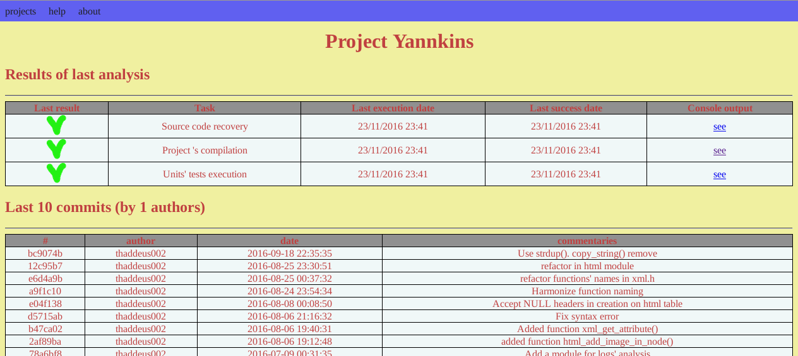

# yannkins

A simple continuous integration program for Linux. It launch configured tasks and create a nice html page to show results. Several projects can be managed.

## What is Yannkins ?

Yannkins is a project which aim is to provide easy continuous integration service for Linux. It can manager several projects, presenting a separate page for each project.
The resume page for a project will show results (build success or failure, tests success or failure, ...) and a table of last revisions or commits.

The project analysis can be launch manually or with cron. A web server is mandatory if you want a remote acces. Local visualisation only need a browser.

Projects will be configured in text files located in directory `${YANNKINS_DIR}/projects/`.
One cron task will perform projects analysis : svn checkout/update or git clone/pull, building, units tests, ... defined in projects' configuration files. After the analysis are executed, an other program will generate HTML reports with the logs of the analysis. 

## What is already available ?

The project is just beginning, so is not still completed.
Only GIT, and SVN are supported.

## How to get started ?

**First download the source code**

> git clone https://github.com/thaddeus002/yannkins.git

**Compile source**

> cd yannkins; make; make install

**Configure a project**

Define a environment variable YANNKINS_HOME to point to the working directory for Yannkins.
Create directories `${YANNKINS_HOME}/projets`, `${YANNKINS_HOME}/log`, `${YANNKINS_HOME}/svn`, and `${YANNKINS_HOME}/www`. This last can be a symbilic link to `/var/www/html`.
Then create a file describing your project. Your can inspire yourself with the example `yannkins/projects/fheroes2` in yannkins' repository.

**Launch the analyse**

Launch the script `analyse.sh`.

**View the results**

A the end of analyse, you must find html files in `${YANNKINS_HOME}/www`. Open index.html in a browser to acces the list of yours projects, with links to projects' pages.
If this process completes succefully, you may want to put the task `/usr/local/bin/analyse.sh` in a crontab to execute it automatically.

## License

Yannkins is free software under GPL v3 license. Read the file [LICENSE](LICENSE) for more informations.

