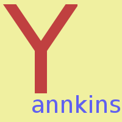
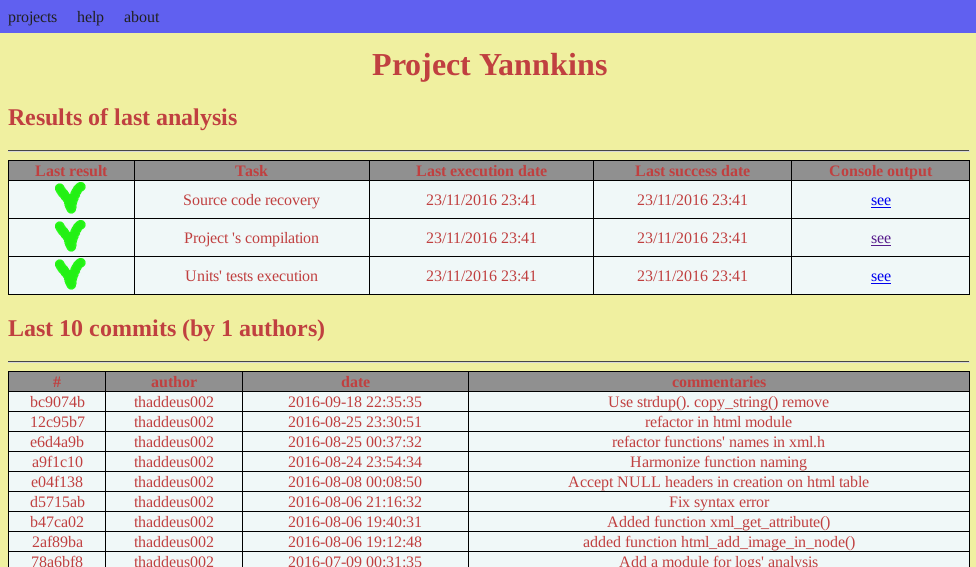

# 

A simple continuous integration program for Linux. It launch configured tasks and create a nice html page to show results. Several projects can be managed.

## What is Yannkins ?

I created this project because I wanted a simple continuous integration system. There is no complex configuration. You only need to set output directory to an accessible directory of an existing web server or if you have no server, launch Yannkins on your workstation.

Yannkins is a project which aim is to provide easy continuous integration service for Linux. It can manager several projects, presenting a separate page for each project.
The resume page for a project will show results (build success or failure, tests success or failure, ...) and a table of last revisions or commits.

The project analysis can be launch manually or with cron. A web server is mandatory if you want a remote acces. Local visualisation only need a browser.

Projects will be configured in text files located in directory `${YANNKINS_DIR}/projects/`.
One cron task will perform projects analysis : svn checkout/update or git clone/pull, building, units tests, ... defined in projects' configuration files. After the analysis are executed, an HTML reports will be generated with the logs of the analysis.

## Supported versionning control systems

  * Git
  * SVN

## How to get started ?

### Download the source code

    $ git clone https://github.com/thaddeus002/yannkins.git

### Compile source

    $ cd yannkins; make; make install

### Configure a project

Define a environment variable `YANNKINS_HOME` to point to the working directory for Yannkins. It may be for example `/var/yannkins` or `${HOME}/.yannkins`.
Create directories `${YANNKINS_HOME}/projects`, `${YANNKINS_HOME}/log`, `${YANNKINS_HOME}/repos`, and `${YANNKINS_HOME}/www`. This last can be a symbilic link to `/var/www/html`.
Then create a file describing your project. Your can inspire yourself with the example `projects/fheroes2` or `projects/yannkins`.

### Launch the analyse

Launch the script `analyse.sh`.

### View the results

At the end of analyse, you must find html files in `${YANNKINS_HOME}/www`. Open index.html in a browser to acces the list of yours projects, with links to projects' pages.
You may want to put the task `/usr/local/bin/analyse.sh` in a crontab to execute it automatically.

## License

Yannkins is free software under GPL v3 license. Read the file [LICENSE](LICENSE) for more informations.

